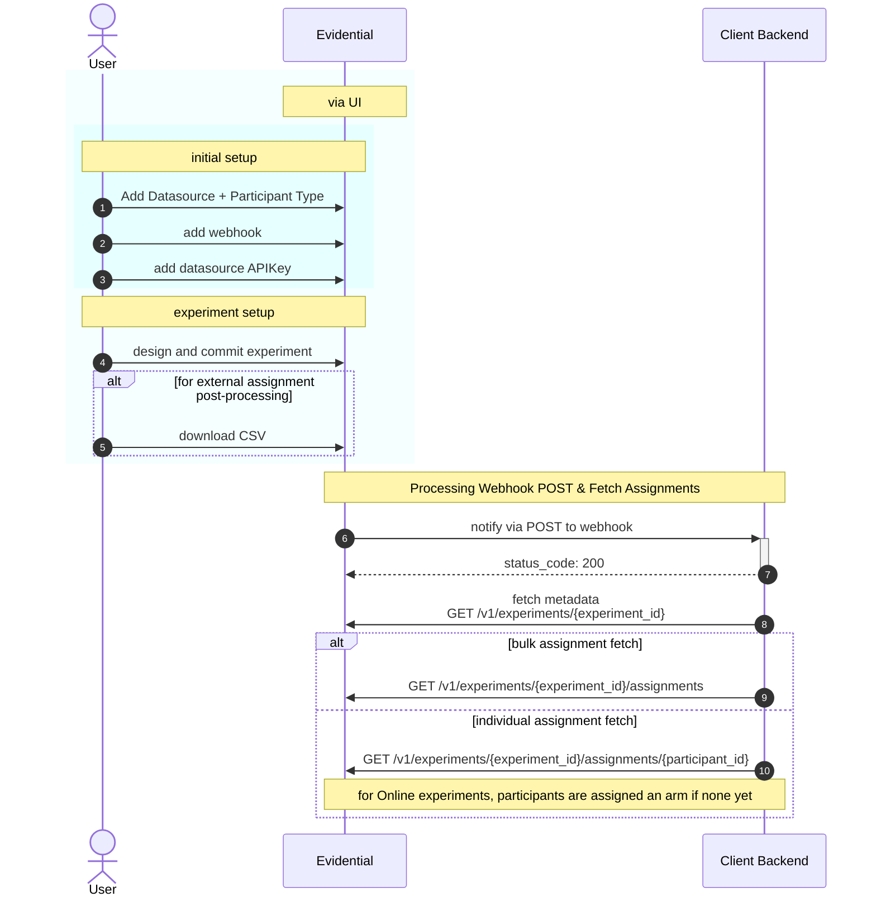

# API Integration

## Documentation

Our interactive API documentation is available here: [https://api.evidential.dev/docs](https://api.evidential.dev/docs)

## Example Integration

Below describes steps typically taken for a client to integrate programmatically with Evidential as
part of automating the execution of experiments in the client's systems. Portion highlighted in
light blue denote human interaction with the Evidential UI.



1. Initial configuration of Datasource (data warehouse) and
    Participant Type (backed by a table in the data warehouse). One datasource configuration can be used by many
    experiments.

1. Configuring a Webhook (in your Organization settings) is required to receive notifications of
    particular events. Your backend must expose an endpoint to which Evidential can POST data to, and
    should validate the `Webhook-Token` header contains a shared secret to ensure requests are
    legitimate.

1. Configuring an API Key (per Datasource; visit its details page) is required to make requests to
    Evidential's backend to fetch experiment and assignment information. All API requests should have
    the custom headers `Datasource-ID:` and the generated `X-API-Key:` attached. These IDs are
    available via copy-to-clipboard buttons in the UI.

1. When a user commits an experiment, the client is notified via the configured webhook. For debugging purposes,
    the history of `experiment.created` webhooks is available in the Evidential UI.

1. (Optional) For Preassigned experiments the user may immediately export a CSV version of the
    participant assignments and any strata for manual uploading to other systems or further
    post-processing or analysis. Other experiment types can also have their assignments exported this
    way as participants are added.

1. [Receiving Notifications] The client's backend system must have an "endpoint" that accepts a JSON
    payload POSTed to the registered webhook. A notification type's body spec is described in the
    webhook's details in the UI.

1. The endpoint should return a HTTP response code indicating success (200-299). Users can look for
    `webhook.sent` in their Recent Events and see success/failure status. If the endpoint does not
    return a 2xx status code, Evidential will retry with an exponential backoff.

1. [Experiment metadata] It is recommended that the client system fetch the newly committed
    experiment's information to facilitate execution on the client's side. It is expected that at a
    minimum, the experiment's start and end date could be used to signal when to enable the
    experiment and later shut it off. Furthermore, for an Online experiment, filters used to target
    eligible participants could be used to determine for whom to issue an assignment request.

1. [Bulk assignment lookup] In addition to CSV exports from the UI, one can also export *all*
    assignments made so far via API as CSV or JSON. This allows a client's backend to know which
    participant ids were (pre)assigned to which arms of an experiment. For example, prior to the
    start date of a Preassigned experiment, one could map the ids to phone numbers used in WhatsApp
    and mark those user profiles with the unique arm id assignments, so that the correct path is
    taken in the experiment's chat flow.

1. [Individual assignment lookup]

- For *Preassigned* experiments, one can look up an individual participant's arm assignment given
    the `experiment_id` and the `participant_id` uniquely identifying it in your system. Requests
    for the same `<experiment_id, participant_id>` will return the same result.

- For *Online* experiments, if the `participant_id` has not been seen yet, Evidential will
    randomly generate and return an arm assignment per the experiment's design.

    !!! note

        For *Online*
        experiments, every request to the endpoint will be assigned an arm, so unless traffic volume is
        very low, it is recommended that you first sample in the client's system the percentage of
        traffic to route into the experiment, and then make the Evidential request for each (vs e.g.
        routing 100% of your users into an Evidential experiment in which 90% are in a Control arm and
        10% in Treatment).

## Additional developer notes

### Request Encapsulation Middleware
Evidential's API server includes middleware that allows clients to encapsulate their request payloads inside a wrapper object. This is useful when the client application has a fixed request format that cannot be changed to match Evidential's expected schema.

For example, if the client application sends requests in the following format:

```json
{
  "data": {
    "payload": {
      "participant_id": "12345",
      "other_field": "value"
    }
  }
}
```

But the expected format by Evidential's API is:

```json
{
  "participant_id": "12345",
  "other_field": "value"
}
```
The client can configure the middleware to extract the actual payload using a JSON Pointer path as follows:

```
path/to/endpoint?_unwrap=/data/payload
```
This will instruct the middleware to unwrap the request body and forward only the inner payload to the API endpoint.

