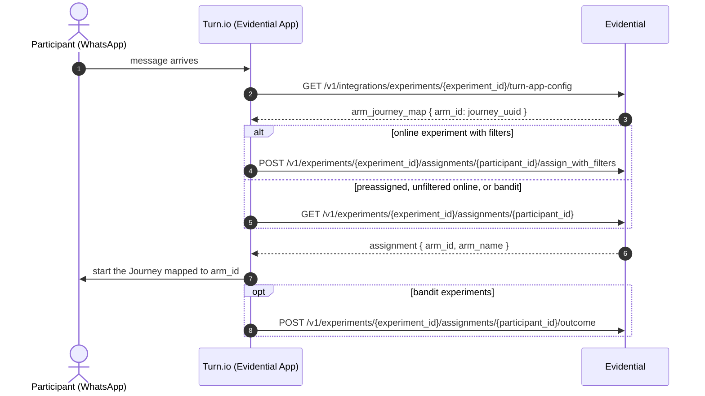
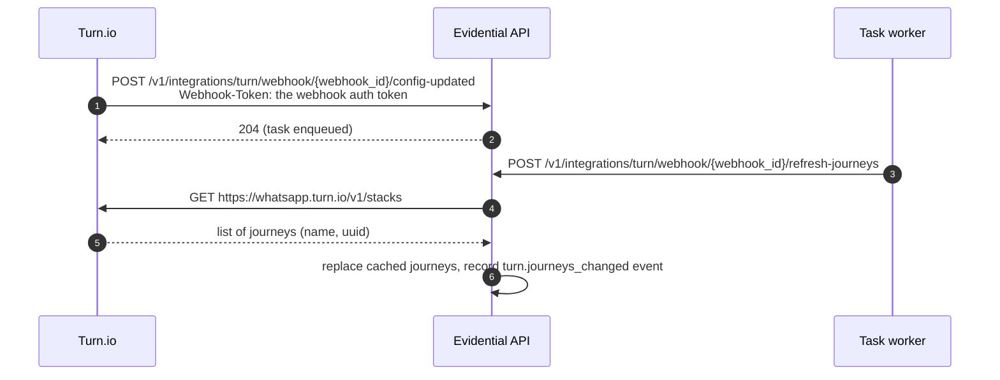

# Messaging Platforms

Many nonprofit programs deliver their treatments over a messaging channel — a WhatsApp chatbot, an SMS
flow, an IVR script. Evidential does not send messages. It decides *which variant a participant should
receive*, and your messaging platform delivers it.

There are two ways to wire that up:

1. **Through a built-in integration.** Evidential currently ships one: **Turn.io**, where an Evidential
    app inside Turn resolves a participant's arm into the Turn Journey they should be sent down.
1. **Through the API.** For any other platform, fetch assignments from the
    [integration API](https://api.evidential.dev/docs) in your own backend and branch your flow on the
    returned arm. See [API Integration](integration.md).

______________________________________________________________________

## Turn.io

[Turn.io](https://whatsapp.turn.io/) organizes conversational content into **Journeys**. The
integration maps each **arm** of an Evidential experiment onto one Turn **Journey**, so that assigning
a participant to an arm is the same thing as putting them on a content path.

### What the integration is made of

| Piece                           | Scope                  | What it does                                                                                                  |
| ------------------------------- | ---------------------- | ------------------------------------------------------------------------------------------------------------- |
| Turn connection                 | One per organization   | Stores the Turn API token Evidential uses to call Turn on your behalf                                         |
| Journey cache                   | One per connection     | The `name → uuid` list of Journeys in your Turn workspace, so Evidential doesn't call Turn on every page load |
| `turn.journeys_changed` webhook | One per organization   | An **inbound** webhook — its ID and auth token go into Turn, which calls Evidential when your Journeys change |
| Arm → Journey mapping           | One per experiment     | Which Journey each arm corresponds to                                                                         |
| Evidential app in Turn.io       | In your Turn workspace | Reads the mapping and the participant's assignment, and starts the right Journey                              |

Note the direction: unlike the outbound webhooks you configure to be notified of `experiment.created`
events, the Turn webhook is one Turn calls *into* Evidential.

### Setting it up

**1. Create a Turn API token.** In Turn.io, go to **Settings → API & Webhooks → Create a Token** and
copy it.

**2. Add the token to Evidential.** In Evidential, open **Third-Party Tools Integrations** and choose
**Add API Key**. On save, Evidential:

- encrypts and stores the token (only its last 4 characters are ever displayed back to you),
- calls Turn to fetch your Journeys and caches them, and
- creates the organization's `turn.journeys_changed` webhook, with an ID and an auth token.

**3. Copy the webhook credentials into Turn.** The same page shows the **Webhook ID** and **Webhook
Auth Token**. Paste both into the Evidential app in your Turn workspace so Turn can notify Evidential
when Journeys change.

**4. Map arms to Journeys, per experiment.** Open a committed experiment and click **Integration
Guide**. Under **Configure integration for third-party tools** you'll find the **Turn.io Arm → Journey
Mapping** section: pick a Journey for each arm and **Save**. The same dialog gives you the
Organization, Datasource and Experiment IDs, a Datasource API key, the arm IDs, and example API calls —
everything the Turn side needs.

!!! note

    The mapping section is disabled until a Turn.io API key exists for the organization. If you see
    *"No Turn.io API key configured"*, go back to step 2.

### How assignment flows at run time

Both calls the app makes are ordinary integration-API calls, authenticated with the `Datasource-ID`
and `X-API-Key` headers from the Integration Guide:

- `GET /v1/integrations/experiments/{experiment_id}/turn-app-config` returns the experiment's
    `arm_journey_map`. It returns **404** when no mapping has been saved for that experiment yet.
- The assignment endpoints are the standard ones, so which one to call depends on the experiment
    design — see [Experiment Design Types](../welcome/experiment-design-types.md). In particular, a
    filtered **Online A/B** experiment must assign through `assign_with_filters` and needs the
    participant's properties in the request body; the plain `GET` would assign everyone. Bandit
    experiments should report outcomes back so the arms can adapt.

!!! note

    If the Turn-side app can only send a fixed request body shape, use the `_unwrap` query parameter
    to have Evidential extract the real payload from inside a wrapper object. See
    [Request Encapsulation Middleware](integration.md#request-encapsulation-middleware).

### Keeping Journeys in sync

Evidential caches your Journey list rather than calling Turn on every request, so the cache has to be
refreshed when Journeys change in Turn.

The notification endpoint only *enqueues* the refresh — Turn's webhook calls time out after roughly
five seconds, and a large refresh can take longer than that. A background worker then triggers the
actual refresh over HTTP, using the same webhook token any other caller would use. The outcome shows
up as a `turn.journeys_changed` entry in your **Recent Events**, with success or failure, so a refresh
that failed is visible rather than silent.

You can also refresh without waiting for Turn:

- **Re-set or rotate the API token** on the Integrations page — setting a token always refreshes the
    Journey list in the same transaction, so the cache can never be valid for a different token.
- **Call `refresh-journeys` directly** with the webhook ID and token.

#### Stale mappings

A saved mapping stores Journey UUIDs. If a Journey is deleted and recreated, or you rotate the token to
a different Turn workspace, those UUIDs may no longer exist. Evidential does not guess: it reports the
drift instead.

- The mapping response includes `stale_arm_ids` — arms whose mapped Journey is not in the latest
    Journey list.
- The experiment's **Integration Guide** button turns red, and the affected arm shows a warning icon.

To fix it, re-select a Journey for each flagged arm and save.

### Security notes

- The Turn API token is **encrypted at rest** and never returned by the API; only a 4-character
    preview is shown so you can tell which token is configured. Tokens containing newlines are
    rejected, to prevent header injection.
- Inbound Turn requests must carry a `Webhook-Token` header matching the organization's webhook auth
    token, otherwise they are rejected with **401**. You can rotate that token from the Integrations
    page at any time — rotating it does not touch the Turn API token or the cached Journeys.
- The Turn-side app authenticates to Evidential like any other client, with a per-datasource
    `X-API-Key` and the `Datasource-ID` header. Manage those keys on the datasource's details page.

### Limits and behaviors worth knowing

- **One Turn connection per organization**, and **one mapping per experiment**.
- A mapping must name **exactly** the experiment's arms — extra or missing arm IDs are rejected with
    **400** — and cannot be saved before a Turn connection exists (**409**).
- **Deleting the Turn connection cascades**: every Turn arm → Journey mapping for the organization's
    experiments is deleted along with the `turn.journeys_changed` webhook, since neither is valid
    without a connection.
- Calls out to Turn time out after 10 seconds. A Turn error or an unreachable Turn API surfaces as
    **502**, and a Journey payload missing `name`/`uuid` as **422**, with Turn's own status and message
    included for debugging.
- An empty Journey list is reported as *"No journeys found in your Turn workspace"* rather than an
    error — create the Journeys in Turn first, then refresh.

### Endpoint reference

Endpoints the Turn-side app calls (datasource API key auth):

| Method | Path                                                           |
| ------ | -------------------------------------------------------------- |
| `GET`  | `/v1/integrations/experiments/{experiment_id}/turn-app-config` |
| `POST` | `/v1/integrations/turn/webhook/{webhook_id}/config-updated`    |
| `POST` | `/v1/integrations/turn/webhook/{webhook_id}/refresh-journeys`  |

Endpoints behind the Evidential UI (these are what the Integrations page and Integration Guide use):

| Method                   | Path                                                                                              |
| ------------------------ | ------------------------------------------------------------------------------------------------- |
| `PUT` / `GET` / `DELETE` | `/v1/m/integrations/turn-connection/{organization_id}`                                            |
| `PUT`                    | `/v1/m/integrations/turn-connection/{organization_id}/regenerate-webhook-token`                   |
| `GET`                    | `/v1/m/integrations/turn-connection/{organization_id}/journeys`                                   |
| `PUT` / `GET` / `DELETE` | `/v1/m/integrations/turn-journey-mapping/datasources/{datasource_id}/experiments/{experiment_id}` |

Full request and response schemas are in the
[interactive API documentation](https://api.evidential.dev/docs).

______________________________________________________________________

## Other platforms

There is no built-in integration for other messaging or survey platforms yet. Until there is, the
generic pattern works well:

- For a **Preassigned A/B** experiment, export the assignments as CSV (or fetch them in bulk from the
    API), map participant IDs to phone numbers, and tag each contact in your platform with its arm so
    the chat flow can branch on it.
- For **Online A/B** and **bandit** experiments, call Evidential from your backend at the moment the
    participant arrives and branch on the returned arm.

Both are described step by step in [API Integration](integration.md). If you'd like to see your
platform supported directly, [contact us](../contact.md).
