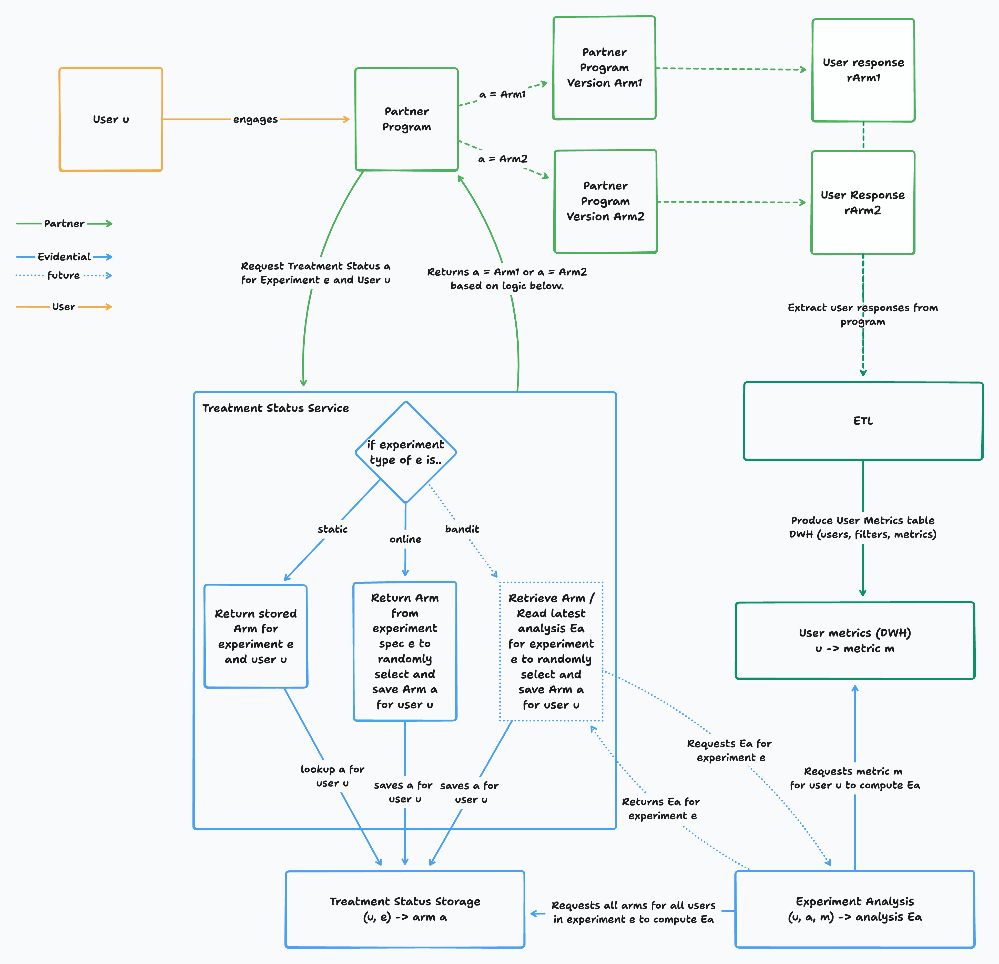

# Overview

Evidential helps your organization implement experiments.

We provide:

- a friendly UI for you to design, validate, execute, and analyze experiments.
- a simple API for your developers to implement the treatments.

The diagram below illustrates the most common integration scenarios.

## Responsibility Diagram

